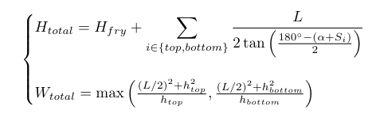

This is the explanation to the Assymetrical Reconstruction of a Potato Model. The goal of this model was to "reverse-engineer" a whole potato from a single french fry from a more central-based cut (of a french fry). It essentialy treats the french fry as a spine of the potato and uses trigonometric projection and circular arc geometry to determine the original vegetable's dimensions.

1. Parameters
In this model we define the fry length (Hfry) as 10cm and the fry width as 2cm, but the width is basically negligible.

2. Split length
The fry is then cut from the center of its length (L), i refer to this as "Split length" and this will exactly be half of its original length so: (Hfry / 2 = L) in this case being 5cm

From now the split length we draw a diagonal line at the same height as our french fry with the same slope angle as the french fry's bottom/top slope and "draw" or "imagine" a new french fry at that exact location almost mirroring our initial french fry.

3. Convergence angle

After getting our second imaginary french fry we draw a perfectly straight line from the top of our initial french fry to the imaginary french fry. Forming a square where all of its sides are 5cm in this case.
We now have the gap line between the 2 potatoes but also the split line from the split length. They equal and perpendicular to eachother, we then draw 2 diagona lines from the edges of the gap line to the center of the split line and calculate its bottom convergence angle which. We then try getting top convergence angle to get a more accurate height and angle for our potato.

4. Vertical expansion

The total height is not just the fry's length and it must also include the edges aka the rounded ends of the potato that were cut off.

We use the peak height using the convergence angle and the slope adjustment, the model projects a vertical distance from the end of he fry to the tip of the potato skin. By allowing Stop and Sbottom to be dfferent (e.g., 13 degrees and 15 degrees), the model can reconstruct a potato that is pointer at one end and blunder at the other and not just mirroring the top to the bottom. The height of the formula is then the sum of the fry length and te two projected peaks.

5 Horizontal expansion

This is the more mathematically advande part of the model. It determines how far the potato "bulges" out at its widest point.

The circular segment rule assumes the skin of the potato follows a circular arc. We then connect the edges of your fry split (L) to the top of our calculated peak (h), there is only one specific circle that fits and this formula calculates the diameter of that circle: ((L/2)^2 + h^2) / h.
since the top and bottom have different slopes, they produce different "bulges" so the model in code uses the max() function to find which of the two arcs creates the widest point of the potato, though there are different ways you can do this such as finding the average.

The final equation is:

